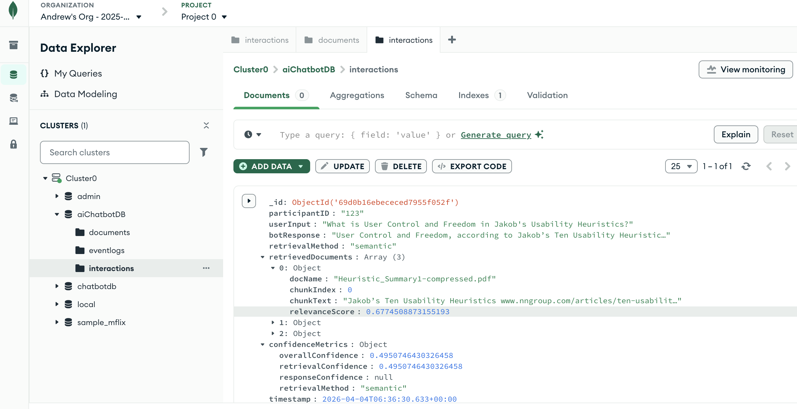
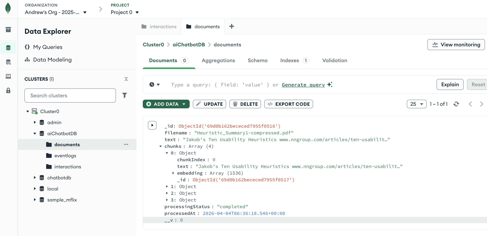
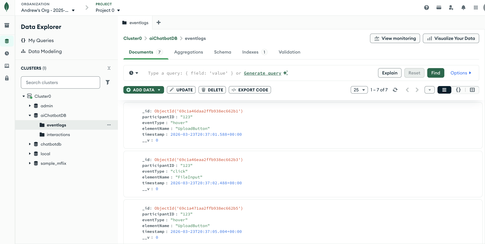
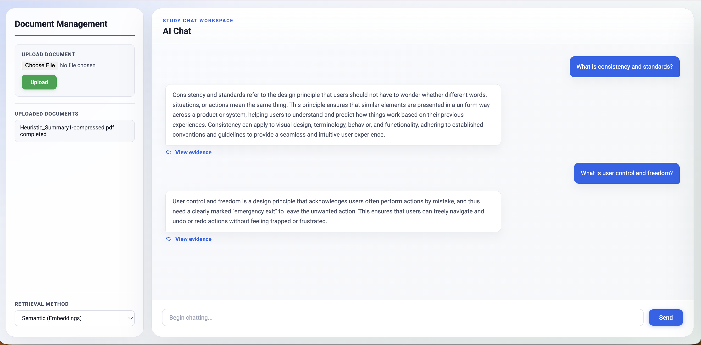

# HCAI_AI_Chatbot

An Express-based chatbot for the HCAI case study. The app uses OpenAI for chatbot responses and MongoDB Atlas to store chat interactions and event logs.

## Prerequisites

- Node.js and npm
- An OpenAI API key
- A MongoDB Atlas connection string

## Setup
1. Clone the repository and `cd` into project directory
    ```bash
    cd HCAI_AI_Chatbot
    ```

2. Install dependencies
    ```bash
    npm install
    ```

2. Copy `.env.example` to `.env`
    ```bash
    cp .env.example .env
    ```

3. Update `.env` with your credentials
    ```bash
    # Replace with your key
    OPENAI_API_KEY=<your_openai_key>
    
    # Replace db_name with your database name e.g. aiChatbotDB
    MONGO_URI=mongodb+srv://<db_username>:<db_password>@cluster0.o9wfh8q.mongodb.net/<db_name>?appName=Cluster0
    ```

## Run the App
1. Start the backend server
    ```bash
    node server.js
    ```

2. Open http://localhost:3000

## Screenshot

### Interaction (with evidence)


### Document (with embedding)


### EventLogs Collection in Atlas


### Chat interface
